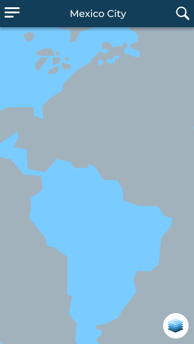
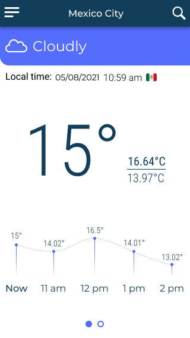
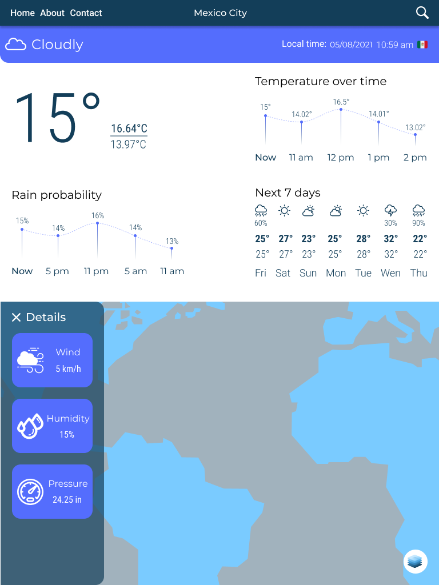
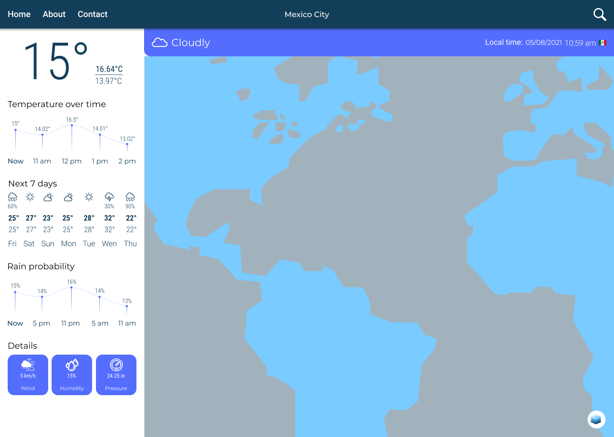

# weatherApp
Web app to know the weather in real time 🌧 all around the world 🌏

# Quick start

In order to manipulate this project, you need to make a fork to your repository, clone it on your local environment and run the next scripts

```
// First of all, install all the dependencies used for the project
npm install

// Afterwards, start coding
npm run start
```

# Check it out

[The Weather App](https://irvingjuarezweatherapp.netlify.app/)

# Quick look

### Mobile




### Tablet


### Desktop


